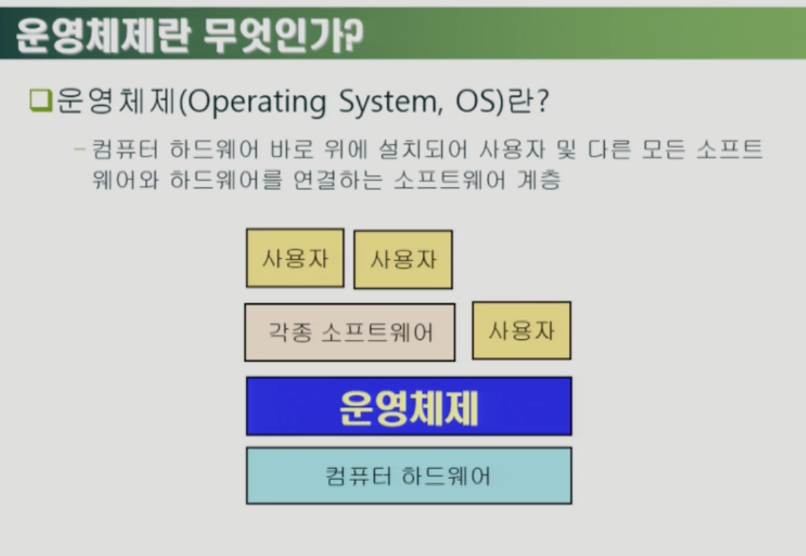

---
## 목차

- [운영체제 개요](운영체제-개요)

 

---

## 운영체제 개요

### 01. 운영체제란 무엇인가요?

&nbsp;&nbsp;&nbsp;&nbsp;  

- 운영체제란 컴퓨터 하드웨어 바로 위에 설치되어 사용자 및 다른 소프트웨어와 하드웨어를 연결하는 소프트웨어 계층입니다  

### 02. 운영체제의 목적은 무엇인가요?

&nbsp;&nbsp;&nbsp;&nbsp;  

&nbsp;&nbsp;&nbsp;&nbsp;  

- 컴퓨터 하드웨어를 직접적으로 다루면 매우 어렵고 복잡하기 때문에 운영체제라는 중간다리를 만듦으로서 컴퓨터 시스템을 편리하게 사용할 수 있는 환경을 제공합니다
- 또한 운영체제는 실행중인 프로그램을 메모리 공간에 적절히 분배함으로서 컴퓨터 시스템의 자원을 효율적으로 관리합니다  

### 03. CPU 스케줄링이란 무엇인가요?

&nbsp;&nbsp;&nbsp;&nbsp;  

- CPU 스케쥴링이란 어떤 프로그램에게 CPU 사용권을 줄지에 대한 과정입니다
- CPU는 하드웨어라 생각을 못합니다 그냥 코드를 읽어와서 계산만 수행합니다
- 어떤 프로그램을 얼마나 CPU를 할당해서 수행할 것인지 정하는 것은 메모리 영역 가장 밑단에 있는 운영체제가 결정합니다
- 즉 CPU스케쥴링은 운영체제의 주요 기능중 하나입니다  

### 04. 디스크 스케줄링이란 무엇인가요?

&nbsp;&nbsp;&nbsp;&nbsp;  

- 디스크는 CPU에 비해 백만배정도 느립니다
- 메모리는 CPU에 비해 백배정도 느립니다
- 디스크는 워낙 느리다보니 프로그램 A로부터도 오고 프로그램 B로부터도 오고 요청이 밀리게 됩니다.
- 이때 요청이 온 순서대로 처리하면 자원이 굉장히 비효율적입니다
- 따라서 순서를 뒤바꿔서라도 자원을 최적화하여 활용하기 위해 운영체제는 디스크 스케쥴링을 합니다
- 예를 들어 엘리베이터가 1층에서 100층으로 가고 있는데 중간에 30층이 눌리면 비록 30층 요청이 늦게 들어왔지만 30층에서 문이 열리는 것과 같습니다  

### 05.  CPU 스케쥴링이란 무엇인가요?

&nbsp;&nbsp;&nbsp;&nbsp;  

- CPU 스케쥴링이란 운영체제의 중요한 역할 중 하나로 어떤 프로그램에게 CPU 사용권을 줄건지 순서를 매기는 것과 같습니다  

### 06. SJF(Shortest-Job-First)란 무엇인가요?

&nbsp;&nbsp;&nbsp;&nbsp;  

- 순서를 매기는데 있어서 p1이 24초, p2, p3이 3초씩 쓴다면 p1이 먼저오더라도 p2,p3에게 CPU를 먼저 내주는 것이 효율적입니다.
- 이처럼 CPU 사용시간이 가장 짧은 프로세스를 먼저 스케쥴링하는 것을 SJF라고 합니다
- 하지만 CPU를 길게써야하는 프로그램이 무한정 기다릴 수도 있는 Starvation(기아 현상)이 발생가능합니다  

### 07. Round Robin(RR) 에 대해 설명해주세요

&nbsp;&nbsp;&nbsp;&nbsp;  

- Round Robin은 CPU 스케쥴링의 방법들 중 하나로 CPU할당시간을 딱 정해서 각 프로세스들이 할당시간만큼만 돌아가면서 사용하고 작업을 완료했으면 I/o로 보내는 방법입니다
- 이 방법의 장점은 CPU를 효율적으로 사용하면서 starvation을 방지할 수 있다는 것입니다  

### 08. 가상메모리란 무엇인가요?

&nbsp;&nbsp;&nbsp;&nbsp;  

&nbsp;&nbsp;&nbsp;&nbsp;  

- 프로그램을 실행하게 되면 디스크의 실행파일들이 메모리(휘발성)로 이동한뒤 프로세스가 되어 실행됩니다
- 하지만 좀 더 세부적으로 따지면 바로 메모리에 올라가는 것이 아닌 중간에 가상메모리라는 단계를 거치게 됩니다.
- 가상메모리에 먼저 메모리 공간이 만들어진 후 물리적인 메모리에는 가상 메모리 중 당장 필요한 부분만 올라가게 됩니다  

### 09.  디스크에서 파일 시스템과 스왑영역에 대해 설명해주세요

- 파일시스템은 전원이 나가더라도 실행 파일이 사라지지 않도록 저장하는 공간입니다
- 가상 메모리가 물리적인 메모리로 올라갈 때 당장 필요한 영역들이 올라가게 됩니다. 이때 나머지 가상메모리들을 스왑영역 디스크에 저장하게 됩니다. 즉 스왑영역은 메모리의 연장공간입니다.
- 컴퓨터가 꺼지면 파일시스템도 남고 스왑영역도 남지만 스왑영역의 메모리는 전원이 꺼질경우 의미가 없기 때문에 전원이 나가기전에 지우는 것이 바람직합니다  

### 10. 메모리가 꽉찼을 경우 또다른 작업을 요청받았을 때 OS는 어떻게 동작하나요?

&nbsp;&nbsp;&nbsp;&nbsp;  

- 미래에 재사용될 가능성이 높은 작업은 후순위로 재사용 가능성이 낮은 작업을 먼저 메모리에서 지웁니다
- 이때 재사용 가능성에 대한 판단은 LRU와 LFU 방식을 사용합니다
- LRU는 가장 오래전에 참조한 페이지를 삭제합니다
- LFU는 참조횟수가 가장 적은 페이지를 삭제합니다  

### 11.  디스크 스케쥴링은 어떻게 동작하나요?

&nbsp;&nbsp;&nbsp;&nbsp;  

- CPU를 쓰고나서 디스크로부터 파일을 읽어야하거나 저장을 해야하면 작업들이 디스크 큐에 쌓이게 됩니다.
- 디스크 접근시간 중 가장 많은 부분을 차지하는 것이 디스크 헤드 이동시간(seek time)입니다. 따라서 디스크 헤드 이동을 얼마나 최소화하느냐가 중요합니다
- 그래서 큐에 들어온 시간 순서대로 처리하는 것이 아니라 순서를 뒤바꿔서라도 헤드이동을 최소화하게 스케쥴링을 하게 됩니다  

### 12. 디스크 접근 시간 구성에 대해 좀 더 자세히 설명해주세요

&nbsp;&nbsp;&nbsp;&nbsp;  

- 디스크 접근시간 (Access time)은 탐색시간(Seek time), 회전지연(Rotational latency), 전송 시간(Transfer time)으로 구성되어 있습니다
- 이러한 3가지요소중 Seektime(헤드 이동)시간이 가장 오래걸리기 때문이 이를 최소화 시키는 것이 목표입니다  

### 13. Seektime 최소화를 목표에 둘 경우 어떤 문제점이 발생하나요?

&nbsp;&nbsp;&nbsp;&nbsp;  

- 앞서 봤던 CPU 스케쥴링에서처럼 Starvation문제가 발생할 수 있습니다
- 즉 탐색시간이 긴 작업의 경우 지나치게 뒤늦게 처리될 수 있습니다  

### 14. 디스크 스케줄링에서 SCAN에 대해 설명해주세요

&nbsp;&nbsp;&nbsp;&nbsp;  

- 이전의 탐색시간 최소화를 최우선했을 경우의 starvation의 문제를 보완하기 위해 SCAN이라는 디스크 스케쥴링 방법이 현재 가장 근본적으로 사용되고 있습니다
- 헤드가 순차적으로 한쪽 끝에서 다른쪽 끝으로 이동하며 가는 길목에 있는 요청들을 처리하는 방식으로 형평성과 효율성을 모두 잡을 수 있는 방법입니다  

### 15. 빠른 CPU와 느린 I/O 장치들의 속도를 어떻게 완충시키나요?

&nbsp;&nbsp;&nbsp;&nbsp;  

- CPU(최상단)와 I/O(최하단) 사이에는 다음과 같은 계층 구조가 있습니다
- 저장장치 계층구조의 특징은 최상단일 수록 빠르지만 값이 비싸서 적은 양의 작업만 처리하는 반면 하단일 수록 느리지만 많은 양의 작업을 가질 수 있습니다
- 휘발성(Volatility)에 있어서도 Secondary영역은 전원이 꺼져도 메모리가 유지되지만 Primary는 메모리가 날라갑니다. 이때 Primary는 CPU가 직접 메모리를 실행시키는 영역입니다
- 즉 Primary는 컴퓨터내부, Secondary는 I/O 장치라고 볼 수 있습니다
- 작업을 처리해야하면 위로 위로 올리고 저장을 해야겠다 싶으면 아래로 내리는 작업을 반복합니다
- 이때 아래로 내리고 위로 올리는 과정에서 시간이 소요되기 때문에 **Caching** 이라는 복사본을 만들어서 위에서 CPU에서 처리할 작업을 그냥 바로 던져버리자라는 개념입니다.  

### 16. 플래시 메모리란 무엇인가요?

&nbsp;&nbsp;&nbsp;&nbsp;  

- 플래시 메모리는 반도체 장치로 하드디스크의 역할을 수행합니다
- 하지만 하드디스크에 비해 크기가 작고, 전력소모가 적으며, 물리적인 충격에 더 강합니다. 이러한 특징은 모바일 장치에 매우 적합합니다
- 플래시메모리는 모바일 용으로 출발했다가 현재에는 컴퓨터 등 전반적인 곳에서 널리 사용되고 있습니다
- 플래시메모리는 read/write 횟수에 제약이 있다는 점, 전하가 조금씩 빠져나가서 같은 공간의 메모리에 변형이 오는등에서 하드디스크에 비해 단점이 있습니다
- 이러한 하드웨어적인 플래시메모리의 단점을 소프트웨어 개발자들이 보완해야합니다. (read/write 횟수를 최소화하거나 전하누수 방지를 위해 저장 공간을 어쩌다 한 번씩 바꿔주는 등등)  

